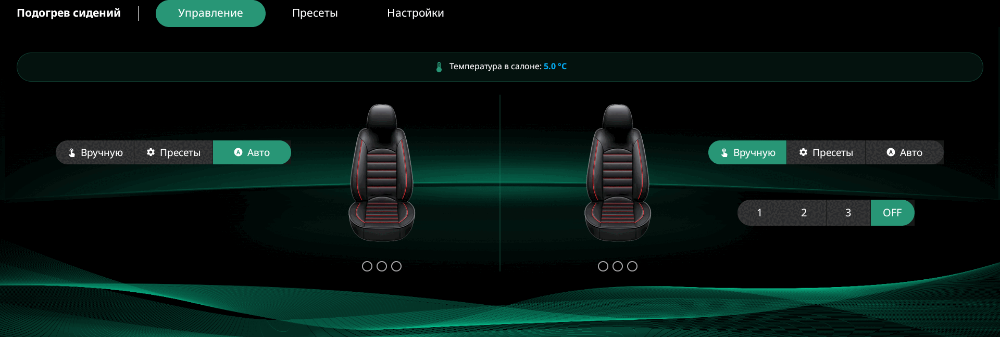

# AutoHeat

[](https://github.com/kaufd/autoheats/releases/latest)
[](https://github.com/kaufd/autoheats/actions/workflows/release.yml)
[-3DDC84?logo=android&logoColor=white)](https://developer.android.com/about/versions/pie)
[](https://openjdk.org/)

Native Android-приложение для автоматического управления подогревом сидений
на головном устройстве автомобилей **Changan UNI-S / CS55 Plus**.

Вместо ручного включения подогрева в каждой поездке AutoHeat может сам поднять
мощность в холодном салоне, плавно снизить её по мере прогрева и выключить оба
сиденья при отключении зажигания. Водительское и пассажирское сиденья работают
независимо.



## Возможности

- **Три режима для каждого сиденья:**
  - `Вручную` — прямой выбор `1 / 2 / 3 / OFF`.
  - `Пресеты` — собственные расписания `3 → 2 → 1 → 0` с порогом температуры.
  - `Авто` — адаптивный каскад по температуре салона.
- **Сохранение состояния:** режимы и последние подтверждённые уровни обоих
  сидений, активные пресеты, тема, видимость температуры и debug-режим.
- **Работа в фоне:** foreground-service владеет соединением с автомобилем и
  продолжает работу после закрытия экрана приложения.
- **Автозапуск после пробуждения головы:** boot receiver и служба специальных
  возможностей помогают восстановить сервис после обычного и быстрого старта
  MediaTek-устройства.
- **Выключение по зажиганию:** после перехода из `ON` в `ACC/OFF/LOCK` приложение
  отправляет обоим сиденьям уровень `0`; состояние `START` при запуске двигателя
  не считается выключением.
- **Три темы:** зелёная, красная и белая, со своими фонами и акцентами.
- **Диагностика без ADB:** скрытая вкладка с кольцевым логом на 500 строк,
  ручным чтением и подстановкой температуры, запуском каскада и
  переподключением к CarService.
- **Встроенное обновление:** проверка GitHub Releases, загрузка нового APK и
  передача штатному установщику Android 9.

## Платформа

- Целевая среда — головное устройство Changan на **Android 9 (API 28)** и
  MediaTek MT8666, с автомобильной подсистемой `android.car.*`.
- Интерфейс рассчитан на фиксированную альбомную компоновку головы; обычные
  телефоны и планшеты не поддерживаются.
- `applicationId` — `com.wt.airconditioner`. Этот пакет находится в whitelist
  CarService головы; с другим идентификатором `CarHvacManager` недоступен.
- APK не содержит Flutter runtime или нативных ABI-библиотек: приложение
  написано на Java и использует системный Android View UI.
- Release APK должен быть подписан стабильным ключом. Для обновления поверх
  уже установленной версии Android требует тот же package ID и ту же подпись.

## Установка

1. Скачайте APK вида
   `AutoHeat-native-v<version>-vc<versionCode>.apk` из
   [GitHub Releases](https://github.com/kaufd/autoheats/releases/latest).
2. Разрешите установку из неизвестных источников на головном устройстве или
   подключитесь к нему через ADB.
3. Установите APK через файловый менеджер либо командой:

   ```bash
   adb install -r AutoHeat-native-v<version>-vc<versionCode>.apk
   ```

4. Откройте вкладку **«Настройки»** и нажмите **«Получить»** напротив
   необходимых разрешений. Если прошивка не может включить службу
   автоматически, AutoHeat откроет системный экран **«Спец. возможности»** —
   включите там службу AutoHeat.

## Как пользоваться

> [!IMPORTANT]
> AutoHeat работает только после полного запуска головного устройства. При этом
> штатный ключ должен находиться в зоне доступности автомобиля. Второй
> поддерживаемый сценарий — автомобиль запущен штатной системой автозапуска.

### Главный экран

На экране два независимых блока: водитель и пассажир. У каждого есть выбор
режима, изображение сиденья и три точки текущего уровня.

- В режиме **«Вручную»** выберите `1`, `2`, `3` или `OFF` в сегментном
  переключателе.
- Тап по изображению сиденья меняет уровень по кругу
  `0 → 1 → 2 → 3 → 0`.
- Если тапнуть сиденье в режиме «Пресеты» или «Авто», оно перейдёт в ручной
  режим и включит уровень `1`.
- Выбор **«Пресеты»** запускает последний выбранный пресет этого сиденья. Если
  пресета ещё нет или он удалён, откроется вкладка создания пресетов.
- Выбор **«Авто»** запускает автоматический каскад сразу, если температура уже
  известна; в следующих поездках он стартует по событию зажигания `ON`.
- Плашка **«Температура в салоне»** показывает показание штатного датчика и
  меняет цвет в зависимости от диапазона.

### Пресеты

Во вкладке **«Пресеты»** сначала выберите водительское или пассажирское
сиденье. Слева расположен редактор, справа — сохранённые расписания.

Для пресета задаются:

- длительность уровней `1`, `2` и `3` от 0 до 15 минут;
- порог запуска: `−5`, `0`, `5`, `10` или `15 °C`;
- имя пресета.

Хотя бы один уровень должен иметь ненулевую длительность. Порог проверяется
только перед запуском: если салон уже теплее, подогрев останется выключенным.
После старта пресет проходит своё расписание строго по таймерам и не меняет его
из-за колебаний температуры.

В карточке пресета доступны редактирование, запуск/остановка и удаление.
Запущенный пресет сохраняется для своего сиденья и снова применяется при
следующем включении зажигания.

### Автоматический режим

Пользовательских настроек у автоматического режима нет. По температуре салона
выбирается максимальная длительность каждого уровня:

| Температура салона | Уровень 3 | Уровень 2 | Уровень 1 | Максимум |
|---|---:|---:|---:|---:|
| `t ≥ +10 °C` | — | — | — | выключено |
| `+5 ≤ t < +10 °C` | 3 мин | 2 мин | 5 мин | 10 мин |
| `0 ≤ t < +5 °C` | 5 мин | 3 мин | 7 мин | 15 мин |
| `−5 ≤ t < 0 °C` | 8 мин | 5 мин | 7 мин | 20 мин |
| `−10 ≤ t < −5 °C` | 12 мин | 7 мин | 7 мин | 26 мин |
| `t < −10 °C` | 15 мин | 10 мин | 8 мин | 33 мин |

У каждого уровня также есть температурный порог досрочного снижения: если
салон прогрелся быстрее таймера, алгоритм сразу переходит на следующий уровень.
Таймер остаётся страховкой на случай, если температура не растёт или датчик не
присылает новое значение.

После завершения `3 → 2 → 1 → 0` каскад не перезапускается от каждого события
датчика. Новый запуск происходит при смене температурного диапазона, повторном
выборе режима или в следующей поездке.

### Настройки

Во вкладке **«Настройки»** можно:

- выбрать зелёную, красную или белую тему;
- показать или скрыть плашку температуры;
- проверить и включить службу специальных возможностей для автозапуска;
- увидеть `versionName` и `versionCode` установленного приложения;
- проверить и установить обновление.

Обновление проверяется автоматически один раз при первом открытии вкладки за
текущий запуск приложения. Если новой версии нет, кнопка скрывается и появляется
текст **«Установлена последняя версия»**. При ошибке сети остаётся кнопка
**«Проверить обновление»**. Если версия найдена, кнопка меняется на
**«Обновить»**.

При первом обновлении Android 9 попросит разрешить AutoHeat установку
неизвестных приложений. После выдачи разрешения APK загрузится через системный
DownloadManager и откроется в штатном установщике. Перед открытием проверяются
package ID и `versionCode`; подпись окончательно проверяет Android.

### Debug-режим

Debug-режим позволяет проверять автоматику летом и разбирать проблемы на
голове без доступа к ADB.

- Для включения или выключения сделайте длительный тап по плашке температуры на
  главном экране. Жест работает и когда отображение температуры скрыто.
- После включения в шапке появится вкладка **«Логи»**.
- Слева находятся последние 500 строк лога, счётчик, автопрокрутка и кнопки:
  **«Запустить каскад»**, **«Прочитать»**, **«Переподключиться»**,
  **«Скопировать»**, **«Очистить»**.
- Справа можно подставить `−15 / −10 / −5 / 0 / 5 / 10 °C` или произвольное
  число. Значение проходит тем же путём, что и событие штатного датчика.

При скрытой вкладке сервисный лог продолжает накапливаться. Подставленная
температура действует до следующего реального показания либо нового ручного
чтения датчика.

## Стек

- Native Android View UI: Java 8 и XML layouts, без Flutter.
- Android Gradle Plugin 8.5.2, Gradle 8.9, JDK 17.
- `compileSdk 33`, `targetSdk 33`, `minSdk 28` — целевая система Android 9.
- `android.car.*` через локальный compile stub `app/libs/android.car.jar`.
- `androidx.viewpager:1.0.0` для вкладок и свайпов между ними.
- `Service`, `BootReceiver` и `AccessibilityService` для фоновой работы и
  восстановления после старта/сна головы.
- `SharedPreferences` для режимов, уровней, пресетов и настроек.
- `HttpURLConnection`, GitHub Releases API, `DownloadManager` и системный
  Package Installer для обновлений.
- JUnit 4 для JVM-тестов алгоритма, зажигания, пресетов и разбора релизов.

## Разработка

Нужны JDK 17 и Android SDK 33. Все команды выполняются из корня репозитория.

```bash
# Полная обязательная проверка
./gradlew test lint assembleRelease

# Только JVM-тесты
./gradlew test

# Установка debug-сборки на подключённую голову или Android 9 эмулятор
./gradlew installDebug

# Запуск приложения через ADB
adb shell am start -n com.wt.airconditioner/.MainActivity
```

Готовый release APK находится в `app/build/outputs/apk/release/` и называется
`AutoHeat-native-v<versionName>-vc<versionCode>.apk`.

Локальная release-сборка без переменных подписи использует debug keystore. Для
стабильной подписи задайте:

- `AUTOHEAT_KEYSTORE_PATH`;
- `AUTOHEAT_KEYSTORE_PASSWORD`;
- `AUTOHEAT_KEY_ALIAS`;
- `AUTOHEAT_KEY_PASSWORD`.

## Релизы

Релизы публикуются автоматически в
[GitHub Releases](https://github.com/kaufd/autoheats/releases) при push тега
`v*`.

Перед созданием тега:

1. Увеличьте `versionName` и обязательно `versionCode` в `app/build.gradle`.
2. Добавьте секцию `## [X.Y.Z] - YYYY-MM-DD` в `CHANGELOG.md`.
3. Выполните локально `./gradlew test lint assembleRelease`.
4. Создайте и отправьте тег:

   ```bash
   git commit -am "Release X.Y.Z"
   git tag vX.Y.Z
   git push origin vX.Y.Z
   ```

Workflow [`.github/workflows/release.yml`](.github/workflows/release.yml)
запускает проверки на JDK 17, собирает подписанный APK, извлекает секцию
changelog и прикладывает APK к GitHub Release.

Встроенное обновление распознаёт APK по суффиксу `-vc<versionCode>.apk`, который
формирует Gradle. Не переименовывайте опубликованный файл вручную: без
достоверного `versionCode` приложение намеренно не предлагает его, чтобы не
допустить даунгрейд. Старый Flutter-артефакт `AutoHeat-v3.apk` по этой причине
игнорируется.

## Документация

- [`ARCHITECTURE.md`](ARCHITECTURE.md) — актуальная схема native-компонентов и
  потоков данных.
- [`AGENTS.md`](AGENTS.md) и [`CLAUDE.md`](CLAUDE.md) — правила работы с
  репозиторием и его инварианты.
- [`CHANGELOG.md`](CHANGELOG.md) — заметные изменения по версиям.

## Назначение и наследие

Это приложение — развитие первой Flutter-версии AutoHeat, созданной
[Александром Бухарским (`@abuharsky`)](https://github.com/abuharsky) на базе его
плагина
[`changan_car_flutter_library`](https://github.com/abuharsky/changan_car_flutter_library).
Текущая реализация полностью native.

Проект предназначен для sideload на конкретную автомобильную платформу, а не
для публикации в Google Play. Стабильная подпись нужна для безопасных обновлений
поверх установленной версии.

## Дисклеймер

Приложение управляет реальным оборудованием автомобиля. Базовый native HVAC
путь проверялся на Changan UNI-S / CS55 Plus, но прошивки, набор разрешений и
реализация `CarHvacManager` могут различаться даже между близкими моделями.

Перед массовой установкой проверяйте конкретную сборку на физической голове:
ручные уровни обоих сидений, авто-каскад, пресеты, выключение по зажиганию,
восстановление после сна и установку обновления. Диагностические сообщения
доступны в скрытой вкладке **«Логи»**.
